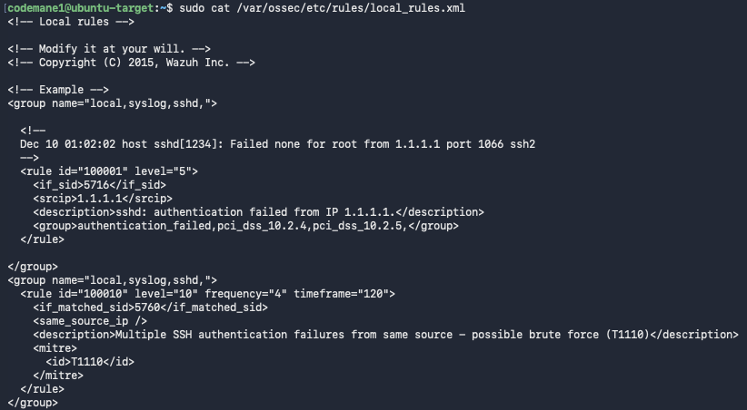
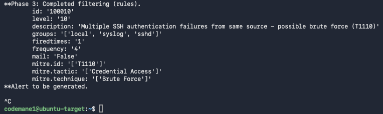
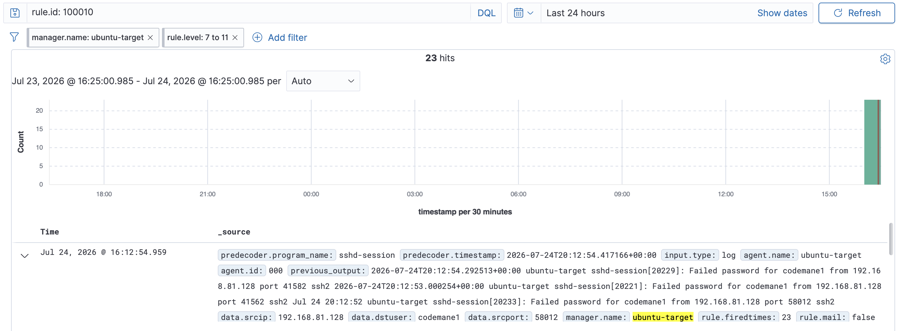
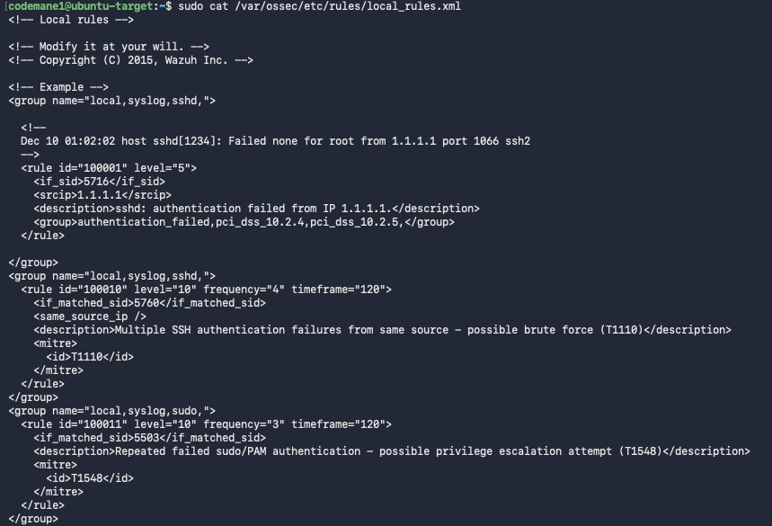
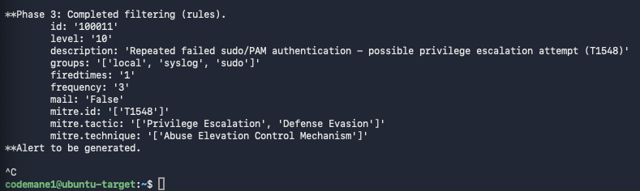
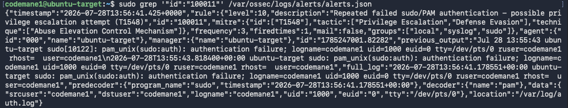
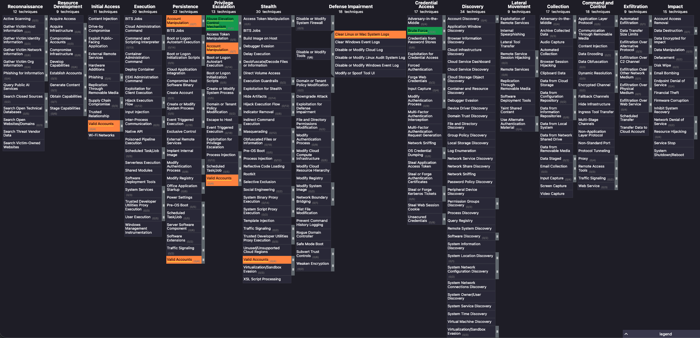
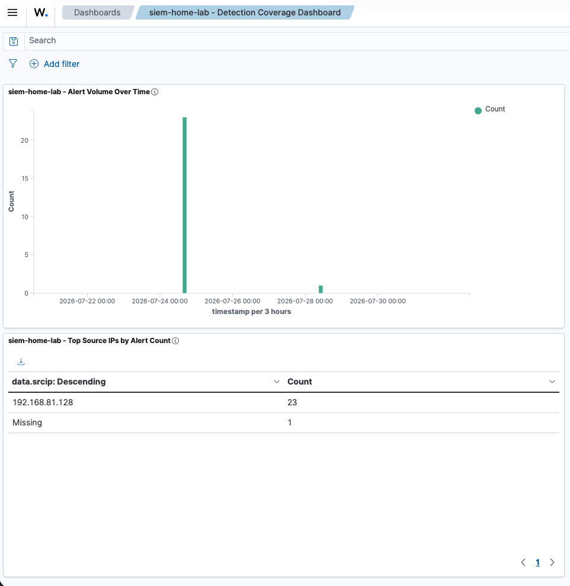

# Home SIEM Lab (Wazuh)

## What this demonstrates

Building and validating a real custom SIEM detection rule — not just installing Wazuh, but proving a rule actually catches the attack it's designed for, debugging it when it silently doesn't, and confirming the fix with a genuine live attack before calling it done.

## Environment

- **Wazuh manager, indexer, and dashboard:** self-hosted, single-node, on an Ubuntu Server VM
- **Monitored host:** the same VM, via Wazuh's built-in local self-monitoring (agent ID `000`) — no separate agent install needed or possible on a manager host, by design
- **Attacker:** Kali Linux VM, same isolated lab network
- **Attack tool:** Hydra, SSH credential brute-forcing

## Process

### 1. Confirm the manager monitors itself

Wazuh managers automatically include a built-in local agent (ID `000`) that reads the host's own logs — a standalone `wazuh-agent` package cannot be installed alongside `wazuh-manager` on the same machine; the package manager itself blocks it as a conflict, since it isn't necessary.

```bash
sudo /var/ossec/bin/agent_control -l
```
Confirmed: `ID: 000, Name: ubuntu-target (server), IP: 127.0.0.1, Active/Local`

### 2. Add the authentication log as a monitored source

```xml
<localfile>
  <log_format>syslog</log_format>
  <location>/var/log/auth.log</location>
</localfile>
```
Added to `/var/ossec/etc/ossec.conf`, alongside the manager's existing default sources.

### 3. Write a custom detection rule for SSH brute-force attempts

```xml
<rule id="100010" level="10" frequency="4" timeframe="120">
  <if_matched_sid>5760</if_matched_sid>
  <same_source_ip />
  <description>Multiple SSH authentication failures from same source - possible brute force (T1110)</description>
  <mitre>
    <id>T1110</id>
  </mitre>
</rule>
```

This rule escalates repeated SSH authentication failures from the same source IP into a labeled brute-force alert, mapped to MITRE ATT&CK technique **T1110 (Brute Force)**.

### 4. Debug it — the rule didn't fire on the first attempt

A live Hydra run produced 206 alert hits, but none of them were the custom rule — they were a different, unrelated built-in Wazuh rule. Rather than assume the rule was broken and guess at a fix, it was validated directly with `wazuh-logtest` against a known sample log line, which surfaced two real, distinct bugs:

- **Missing `frequency`/`timeframe` attributes.** `<if_matched_sid>` requires these on the `<rule>` tag itself to define a countable time window — without them, the rule has no actual evaluation logic and silently never fires, regardless of how correct everything else looks.
- **Wrong base rule ID.** The rule was written to watch for occurrences of rule `5716`, but `wazuh-logtest` showed this specific log format actually decodes to rule `5760` on this Wazuh version — a one-digit-off assumption that would have made the rule permanently blind, even with the frequency/timeframe fix in place.

### 5. Validate the fix directly, before re-attacking



```bash
sudo /var/ossec/bin/wazuh-logtest
```
The same sample line, submitted four times (matching the `frequency="4"` threshold), correctly fired rule `100010` on the fourth submission — confirmed via the tool's own output, independent of any live network traffic.



### 6. Confirm with a real attack

```bash
hydra -t 4 -l codemane1 -P /usr/share/wordlists/rockyou.txt ssh://192.168.81.130
```
(`-t 4` limits parallel connections — OpenSSH's own `PerSourcePenalties` defense started dropping connections from the attacker under Hydra's default 16-thread setting, a real SSH hardening feature worth noting in its own right.)

Result: rule `100010` fired 23 times against the real attack traffic, correctly attributing the source IP (`192.168.81.128`) and citing MITRE technique T1110.



## Key finding

A detection rule that "looks correct" and a detection rule that actually fires are two different things. Two independent, specific bugs — a missing frequency/timeframe pairing and an incorrect base rule ID — both had to be found and fixed before this rule caught anything, and neither would have been obvious without testing against `wazuh-logtest` first rather than going straight to a live attack. This is the actual discipline behind detection engineering: validate the logic in isolation, then confirm against real traffic — not the other way around.

## Files in this repo

- `wazuh_detection_evidence.json` — the real alert record from the live Hydra-triggered detection, including `firedtimes`, source IP, and MITRE mapping
- `sudo_privesc_detection_evidence.json` — the real alert record from the live privilege-escalation detection (see addendum below)
- `mitre_navigator_coverage_layer.json` — exported MITRE ATT&CK Navigator layer covering both confirmed detections plus a curated set of planned next detections, each with a citation comment (see addendum below)
- `wazuh_dashboard_saved_objects.ndjson` — exported OpenSearch Dashboards saved-objects file for the custom detection dashboard, re-importable into any Wazuh instance (see addendum below)
- `screenshots/` — terminal and dashboard captures, placed inline throughout this README next to the step each one documents, rather than grouped separately

## What I'd do differently in production

- Test every custom rule with `wazuh-logtest` as a standing first step, not a fallback after a live test fails — it would have caught both bugs here in minutes instead of after a full attack run.
- Tune Hydra's thread count to stay under whatever SSH rate-limiting is in place *before* the first attempt, rather than discovering the limit via a failed run.

---

## Addendum: A Second Detection Rule — Repeated Failed `sudo`/PAM Authentication (T1548)

### What this adds

A second, independently validated detection rule watching for repeated failed privilege-escalation attempts (`sudo`/PAM authentication failures) — demonstrating that the first rule's validated methodology (write → `wazuh-logtest` → live-fire confirm) is a repeatable process, not a one-off.

### The rule

```xml
<rule id="100011" level="10" frequency="3" timeframe="120">
  <if_matched_sid>5503</if_matched_sid>
  <description>Repeated failed sudo/PAM authentication - possible privilege escalation attempt (T1548)</description>
  <mitre>
    <id>T1548</id>
  </mitre>
</rule>
```

Deliberately does **not** use `<same_source_ip />` — unlike an SSH login, a local `sudo` failure carries no source IP at all, so reusing that tag from the first rule without checking would have silently broken the frequency grouping.



### The debugging arc — a real, multi-layered one

**1. A fabricated test line validated against the wrong rule entirely.** The initial test line used to check `wazuh-logtest` was written by hand to look plausible, rather than pulled from real `auth.log` output. It happened to decode to rule `5404` — a real Wazuh rule, just not the one this system's actual `sudo` failures ever produce. Built and "validated" against it, the new rule would have silently never fired against genuine traffic.

**2. Caught by checking the real log directly, not trusting the synthetic line.** Comparing the fabricated test line against actual `auth.log` output from a real failed-`sudo` attempt showed they didn't match at all. The real line — `pam_unix(sudo:auth): authentication failure; ...` — decodes to a completely different base rule: `5503`.

**3. Removing the wrong rule broke the entire manager.** A `sed`-based deletion intended to remove the rule built against `5404` left an orphaned, empty `<group>...</group>` block behind — valid-looking XML that Wazuh's rule parser correctly rejected (`"Group 'group' without any rule"`), taking the whole `wazuh-manager` service down.

**4. Fixed by inspecting the actual file content, not guessing at the damage.** Viewing the full `local_rules.xml` directly showed the exact empty block; a second, precise deletion removed only that fragment, and the manager came back up clean.

**5. Re-validated against the real log line, then confirmed live.** With the rule correctly built against `5503`, `wazuh-logtest` confirmed it firing on the third submission of the real log line.



A genuine live test — three real failed `sudo` authentication attempts — triggered rule `100011` for real, captured in `sudo_privesc_detection_evidence.json`.



### Key finding

Every one of the first rule's lessons (validate before attacking, don't assume a base rule ID) held up as generally correct — but this rule's own process surfaced a further, more subtle version of the same failure mode: a synthetic test input can pass validation while still being validated against the *wrong thing*. The fix isn't "trust `wazuh-logtest`" — it's "trust `wazuh-logtest` run against genuinely real data," which is a meaningfully stricter standard than it first appears.

---

## Addendum: MITRE ATT&CK Navigator Detection Coverage Layer

### What this adds

A portable, re-usable coverage layer mapping this lab's real, validated detections onto the industry-standard ATT&CK framework — the same visual language analysts and hiring managers use to communicate coverage at a glance, distinct from citing a technique ID inside a rule's own XML. Paired with a small, deliberately curated "planned next" layer showing where detection coverage goes from here.

### Coverage layer — what's actually detected

Three techniques, each backed by a specific rule ID and a live-fire confirmation already documented above, not by assertion:

| Technique | Rule | Confirmed via |
|---|---|---|
| T1110 — Brute Force | 100010 (base SID 5760) | live Hydra SSH brute-force attack |
| T1548 — Abuse Elevation Control Mechanism | 100011 (base SID 5503) | live repeated failed sudo/PAM attempts |
| T1685.006 — Disable or Modify Tools: Clear Linux or Mac System Logs | 550 | live FIM detection during the real authentication-log-tampering incident, documented in `incident-reports` |

### A real framework-version finding along the way

Building the layer surfaced a genuine, current ATT&CK change: version 19 (released April 2026) split the former "Defense Evasion" tactic into two new tactics, Stealth and Defense Impairment. One technique — clearing system logs — was revoked from its old ID (T1070.002, under the old Defense Evasion framing) and reissued as **T1685.006 ("Disable or Modify Tools: Clear Linux or Mac System Logs")** under the new Defense Impairment tactic. The reframing is meaningful, not just a renumbering: MITRE's rationale is that clearing logs isn't just about *evading* detection while defenses keep running — it's about *actively degrading* a defensive control. That's a more accurate description of what a Wazuh FIM rule watching for log tampering would actually be catching.

This technique started as a roadmap item — a planned Wazuh FIM rule watching `/var/log/auth.log` for tampering. It's since moved into the coverage layer above: the real authentication-log-tampering incident documented in `incident-reports` fired rule 550 against exactly this technique, with real evidence (hash and size changes on the tampered file), not a synthetic test.

### Roadmap layer — honest, infrastructure-grounded next steps

Rather than a blanket "gap analysis" against the full ATT&CK matrix — which every home lab trivially fails and which proves nothing on its own — the layer marks two specific techniques chosen because they're detectable using log sources Wazuh already ingests from this host, with no new infrastructure required:

- **T1078 — Valid Accounts.** Planned: detect a successful authentication immediately following a failed-attempt streak, or authentication at unusual hours — different rule logic than rule 100010's frequency-threshold approach to the same log source.
- **T1098 — Account Manipulation.** Planned: detect Linux-side group membership changes (e.g. `usermod -aG sudo`) via `auth.log`.



### Key finding

A coverage layer alone shows what's proven. Pairing it with a small, deliberately curated set of "planned next" techniques — grounded in what the existing log sources can actually support, not a generic wishlist — turns the same artifact into a prioritization tool: an honest answer to "what would you build next, and why," rather than just a scorecard of what's already done. The layer is also a living artifact by design — as new rules get added, it gets reopened and extended rather than rebuilt from scratch.

---

## Addendum: Custom Wazuh Dashboard Panels

### What this adds

Two custom visualization panels, hand-built directly in the Wazuh dashboard's own visualization builder (OpenSearch Dashboards) and combined into a single saved dashboard — the literal daily task of working inside a live SIEM's UI tooling, using genuinely live alert data this lab's own rules already produced, not a synthetic dataset.

### The panels

**Alert Volume Over Time** — a vertical bar chart, filtered to `rule.id:(100010 OR 100011)`, bucketed on `@timestamp` via a date histogram. Deliberately scoped to July 20 – August 1, 2026, matching this repo's own documented attack window. A separate, later live-fire SSH brute-force run — built for a different portfolio piece, against a different target account — also happens to trip rule 100010, and including it would have made this panel's totals diverge from the counts already documented earlier in this README. Excluding it was a deliberate scoping decision, not an oversight.

**Top Source IPs by Alert Count** — a data table, using a Terms aggregation on `data.srcip` with "show missing values" enabled. Result: `192.168.81.128` with 23 hits, plus a `Missing` row with 1 hit.



### A real finding: what the "Missing" count actually means

The `sudo`/PAM rule (100011) carries no source-IP field by design — a local privilege-escalation attempt has no remote source address to log — so it was expected to land in the `Missing` bucket rather than under an IP. What needed a second look was the count itself: `Missing` shows **1**, not the 3 individual failed attempts documented in the addendum above. That's not a discrepancy — rule 100011 has `frequency="3"`, meaning it evaluates a *threshold* being crossed and emits exactly one alert document when it's met, not one alert per underlying failed attempt. The three real failures are the trigger condition; the alert is the single, resulting record. Total across both panels: 23 + 1 = 24 alert documents, which is exactly correct once counted this way.

### Key finding

A functioning custom dashboard built entirely from real, live alert data — evidence of working inside an actual SIEM's visualization tooling, not just its rule engine. Building it also surfaced two things worth being deliberate about with real data: cross-project alert data can silently bleed into a filtered view if the time range isn't scoped carefully, and a frequency-based rule's alert count reflects *triggered thresholds*, not *raw events* — a distinction that matters when reconciling a dashboard's numbers against a written incident record.